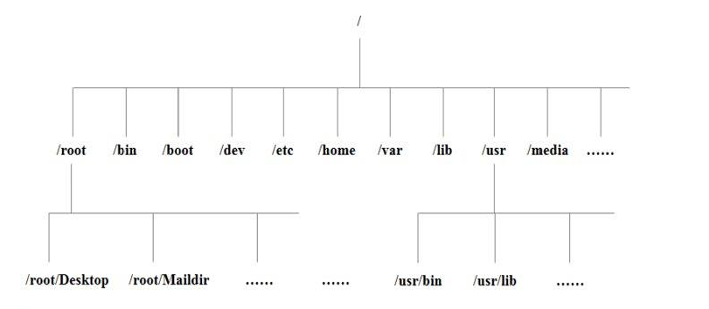

1、Linux 开山篇

1.1、课程内容介绍

1.2、Linux的学习方向

1.2.1、Linux运维工程师

1.2.2、Linux嵌入式开放工程师

1.2.3、在Linux下做各种程序开发

1.2.4、示意图

1.3、Linux的应用领域

1.3.1、个人桌面领域

1.3.1、服务器领域

1.3.1、嵌入式应用领域

1.4、学习Linux的阶段

第1阶段：Linux环境下的基本操作命令，包括文件命令（rm、mkdir、chmod、chown）、编辑工具（vi、vim）、Linux用户管理（useradd、usedel、usermod）等 
第2阶段：Linux的各种配置（系统环境变量配置、网络配置、服务配置） 
第3阶段：Linux下搭建各种语言的开发环境（Java、PHP、Python） 
第4阶段：能编写shell脚本，对Linux服务器进行维护 
第5阶段：能进行安全设置，防止攻击，保障服务器正常运行，能对系统调优 
第6阶段：深入理解Linux系统（对内核有研究），熟悉大型网站应用架构组成，并熟悉各个环节的部署和维护方法 

1.5、学习建议

2、Linux基础入门

2.1、Linux介绍

主要发行版：Ubuntu(乌班图)、RedHat(红帽)、CentOS、Debain[蝶变]、Fedora、SuSE、
OpenSUSE 

2.2、unix怎么来的

2.3、Linux怎么来的

2.4、Linux和Unix关系图

2.5、Linux和Windows比较

3、基础篇vm和Linux系统的安装

3.1、安装vm和CentOS

3.2、vm软件和CentOS地址

3.3、vm安装步骤

3.4、CentOS安装步骤

3.5、CentOS终端使用和联网

3.6、vmtools安装

3.6.1、介绍

1）.可直接在Windows和Linux之间复制粘贴命令
2）.可设置Windows和Linux共享文件夹
3）.示意图

为了实现上图功能安装vmtools

3.7、vmtools的安装和使用

3.7.1、vmtools的安装步骤

3.7.2、使用Windows来设置Windows和Linux之间的共享文件加

4、基础篇Linux目录结构

4.1、基本介绍

Linux目录基本介绍：

4.2、目录结构的具体介绍

Linux目录具体介绍：

1) /bin[**重点**]（/usr/bin、/usr/local/bin）
  + 是binary的缩写，存放最经常使用的命令

2) /sbin（/usr/sbin、/usr/local/sbin）
  + s是Super User的意思，存放的是系统管理员使用的系统管理程序

3) /home[**重点**]
  + 存放普通用户的主目录，在Linux中每个用户都有自己的目录，一般该目录名是用户名

4) /root[**重点**]
  + 该目录为系统管理员，也称作超级权限者的用户主目录

5) /lib
  + 系统开机所需要最基本的动态连接共享库，其作用类似于Windows里的DLL文件。几
    乎所有的应用程序都需要用到这些共享库。

6) /lost+found
  + 这个目录一般情况下是空的，当系统非法关机后，这里就存放了一些文件。

7) /etc[**重要**]
  + 所有的系统管理所需要的配置文件和子目录my.cof

8) /usr[**重要**]
  + 这是一个非常重要的目录，用户的很多应用程序和文件都放在这个目录下，类似与
    windows下的program files目录。

9) /boot[**重要**]
  + 存放的是启动Linux时使用的一些核心文件，包括一些连接文件以及镜像文件

10) /proc 
  + 这个目录是一个虚拟的目录，它是系统内存的映射，访问这个目录来获取系统信息。

11) srv
  + service缩写，该目录存放一些服务启动之后需要提取的数据。

12) /sys
  + 这是linux2.6内核的一个很大的变化。该目录下安装了2.6内核中新出现的一个文件系统

13) /tmp
  + 这个目录是用来存放一些临时文件的。

14) /dev
  + 类似于windows的设备管理器，把所有的硬件用文件的形式存储。

15) /media[**重点**]
  + linux系统会自动识别一些设备，例如U盘、光驱等等，当识别后，linux
    会把识别的设备挂载到这个目录下。

16) /mnt[**重点**]
  + 系统提供该目录是为了让用户临时挂载别的文件系统的，我们可以将外部的存储挂
    载在/mnt/上，然后进入该目录就可以查看里的内容了。d:/myshare

17) /opt
  + 这是给主机额外**安装软件**所摆放的目录。如安装ORACLE数据库就可放到该目录下。
    默认为空。

18) /usr/local[**重点**]
  + 这是另一个给主机额外安装软件所**安装的目录**。一般是通过编译源码方式安装的程序。

19) /var[重点]
  + 这个目录中存放着在不断扩充着的东西，习惯将经常被修改的目录放在这个目录下。
    包括各种日志文件。

20) /selinux [security-enhanced linux] 360
  + SELinux是一种安全子系统,它能控制程序只能访问特定文件。

4.3、Linux目录总结

1) Linux有且只有一个根目录 /
2) Linux的目录是规划好的，不能乱放目录
3) Linux是以文件管理我们的设备的，因此Linux系统，一切皆为文件
4) Linux各个目录应该放什么内容，要有一个认识
5) 学习后，脑海要有一个Linux目录树

5、实操

6、实操vi和vim
