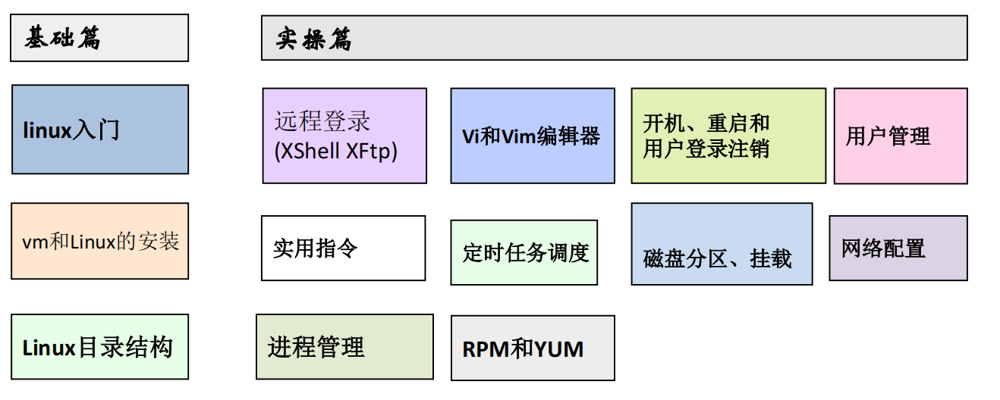
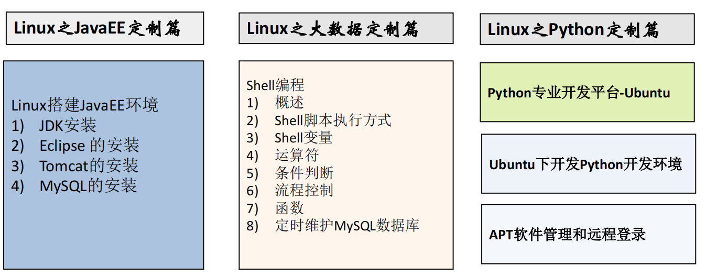
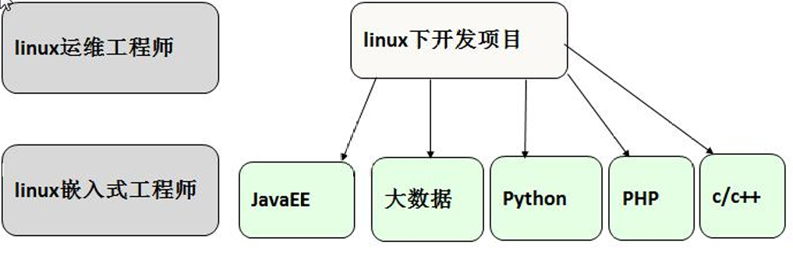
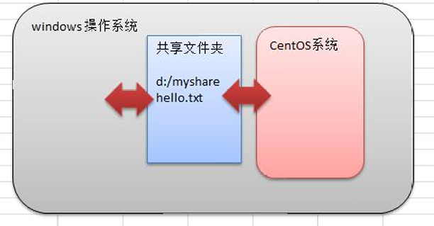

1、Linux 开山篇

1.1、课程内容介绍

1.2、Linux的学习方向

1.2.1、Linux运维工程师

1.2.2、Linux嵌入式开放工程师

1.2.3、在Linux下做各种程序开发

1.2.4、示意图

1.3、Linux的应用领域

1.3.1、个人桌面领域

1.3.1、服务器领域

1.3.1、嵌入式应用领域

1.4、学习Linux的阶段

第1阶段：Linux环境下的基本操作命令，包括文件命令（rm、mkdir、chmod、chown）、编辑工具（vi、vim）、Linux用户管理（useradd、usedel、usermod）等 
第2阶段：Linux的各种配置（系统环境变量配置、网络配置、服务配置） 
第3阶段：Linux下搭建各种语言的开发环境（Java、PHP、Python） 
第4阶段：能编写shell脚本，对Linux服务器进行维护 
第5阶段：能进行安全设置，防止攻击，保障服务器正常运行，能对系统调优 
第6阶段：深入理解Linux系统（对内核有研究），熟悉大型网站应用架构组成，并熟悉各个环节的部署和维护方法 

1.5、学习建议

2、Linux基础入门

2.1、Linux介绍

主要发行版：Ubuntu(乌班图)、RedHat(红帽)、CentOS、Debain[蝶变]、Fedora、SuSE、
OpenSUSE 

2.2、unix怎么来的

2.3、Linux怎么来的

2.4、Linux和Unix关系图

2.5、Linux和Windows比较

3、基础篇vm和Linux系统的安装

3.1、安装vm和CentOS

3.2、vm软件和CentOS地址

3.3、vm安装步骤

3.4、CentOS安装步骤

3.5、CentOS终端使用和联网

3.6、vmtools安装

3.6.1、介绍

1）.可直接在Windows和Linux之间复制粘贴命令
2）.可设置Windows和Linux共享文件夹
3）.示意图

为了实现上图功能安装vmtools

3.7、vmtools的安装和使用

3.7.1、vmtools的安装步骤

3.7.2、使用Windows来设置Windows和Linux之间的共享文件加

4、基础篇Linux目录结构

5、实操

6、实操vi和vim
